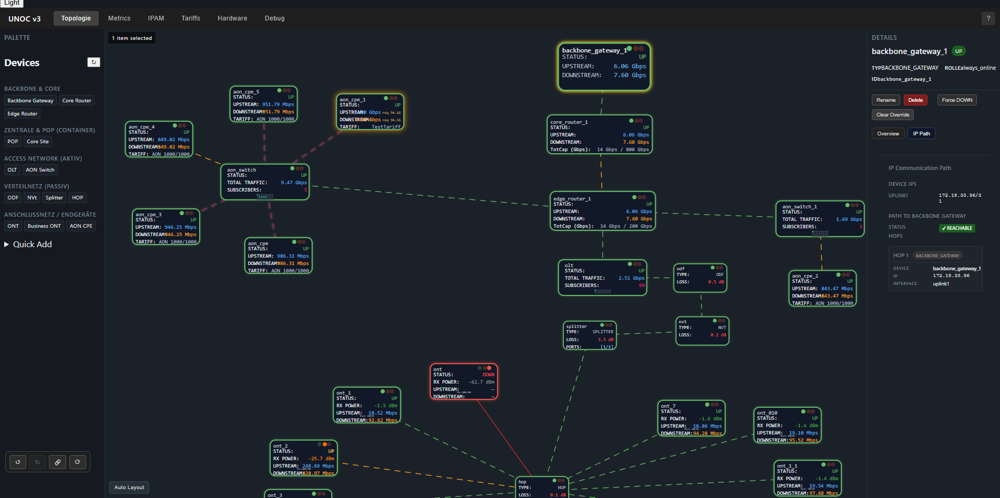
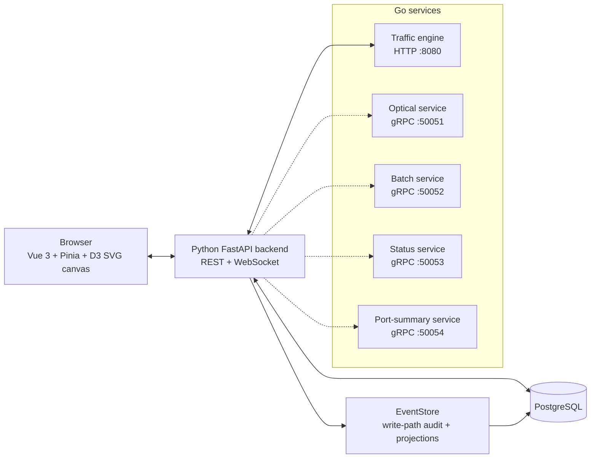

# UNOC - Fiber Access Network Simulation

UNOC is a distributed telecom/fiber-access network simulator for NOC-style operator workflows, with an interactive topology canvas that updates in real time.



- Real-time SVG topology canvas for OLTs, AON switches, ONTs, CPEs, ODFs, splitters, and fiber links.
- Optical, IPAM, provisioning, traffic, congestion, and analytics behavior modeled across the stack.
- Polyglot runtime: Vue 3 + Pinia + D3 frontend, Python/FastAPI backend, PostgreSQL, Go HTTP/gRPC services.

## What it does

- Builds and edits telecom access-network topologies with drag-and-drop devices and links.
- Simulates GPON/AON optical physics: signal budget, RX power, path margins, and no-signal states.
- Handles L2/L3 provisioning, interface state, subscriber/device mapping, and IPAM.
- Generates live traffic with capacity limits, congestion detection, and proportional bottleneck shaping.
- Streams real-time device, link, traffic, and status updates to the frontend over WebSockets.
- Maintains derived analytics for counts, utilization, aggregation, and mismatch diagnostics.
- Exposes debug endpoints that explain physical/service/analytics state instead of hiding conflicts.

## Why it is non-trivial

UNOC is not just a topology drawing tool. The simulation has to keep optical reachability, L2/L3 provisioning, operational status, traffic generation, congestion shaping, and derived analytics coherent as the topology changes. The project uses an explicit truth model so physical topology, service provisioning, and analytics can disagree visibly and be debugged instead of silently overwriting each other.

## Architecture

UNOC separates state into three truth layers:

- `PHYSICAL_TRUTH`: devices, ports, links, topology
- `SERVICE_TRUTH`: subscribers, provisioning, ONT/CPE mapping
- `ANALYTICS_TRUTH`: derived counts, utilization, aggregation



The Go traffic engine is mandatory in the recovered stack. The optical, batch, status, and port-summary gRPC services are optional helpers with Python fallback or degraded behavior when unavailable.

## What I built / improved

- Recovered and documented the real Python/FastAPI + Vue 3 + Go services stack after the README still described an obsolete implementation.
- Stabilized correctness issues tracked in the simulation audit backlog, including stale metrics reconciliation, optical warning display, EventStore telemetry persistence, deterministic port ordering, provisioning status persistence, and link-created metadata.
- L3 status recompute reduced from O(N^2) to O(N): recompute over 200 leaves dropped from ~24.6 s to ~0.29 s (~85x), measured with a reproducible micro-benchmark (backend/tests/perf/bench_l3_recompute.py) and py-spy.
- Kept the EventStore as write-path audit/projection infrastructure while preserving the current operational DB mutation path.

See [docs/AUDIT_BACKLOG.md](docs/AUDIT_BACKLOG.md) for the shipped audit batches and remaining work.

## Quick start (reviewers)

Use the verified recovered-stack guide in [docs/local_start.md](docs/local_start.md). From the repo root on Windows PowerShell:

```powershell
.\scripts\start-stack-logged.ps1 -IncludeOptionalGoServices
.\scripts\status-stack.ps1
```

Open:

- Frontend: `http://127.0.0.1:5173`
- Backend health: `http://127.0.0.1:5001/api/health`
- Traffic engine health: `http://127.0.0.1:8080/health`

Default local ports:

| Service | Port |
| --- | --- |
| Frontend (Vite) | `5173` |
| FastAPI backend | `5001` |
| Go traffic engine | `8080` |
| PostgreSQL | `5432` |
| Go optical service | `50051` |
| Go batch service | `50052` |
| Go status service | `50053` |
| Go port-summary service | `50054` |

One-time setup, database reset/seed commands, environment flags, and manual start order are documented in [docs/local_start.md](docs/local_start.md). Recovery status and known test drift are tracked in [RECOVERY_STATUS.md](RECOVERY_STATUS.md).

## Repo map

- [backend/](backend/) - FastAPI app, domain services, EventStore, projections, WebSocket endpoints.
- [unoc-frontend-v2/](unoc-frontend-v2/) - Vue 3 + Pinia + D3 topology UI.
- [engine-go/](engine-go/) - Go traffic engine and gRPC helper services.
- [docs/local_start.md](docs/local_start.md) - verified local startup guide.
- [RECOVERY_STATUS.md](RECOVERY_STATUS.md) - recovered-stack status, environment notes, known drift.
- [docs/AUDIT_BACKLOG.md](docs/AUDIT_BACKLOG.md) - correctness/performance audit backlog and shipped batches.
- [AGENTS.md](AGENTS.md) - repository operating rules and truth-model constraints.
- [backend/tests/perf/bench_l3_recompute.py](backend/tests/perf/bench_l3_recompute.py) - reproducible L3 recompute micro-benchmark.

## Project status & limitations

- Verified: the recovered local stack is Python/FastAPI + Vue 3 + Go services + PostgreSQL, with startup documented in [docs/local_start.md](docs/local_start.md).
- Verified: the stack exposes observability/debug endpoints for state mismatches, including physical/service/analytics truth diagnostics.
- Optional: Go optical, batch, status, and port-summary services can run alongside the backend; the backend can fall back or degrade when they are unavailable.
- Current architecture: EventStore records write-path audit/projection events in a dual-write system. The project is not fully event-sourced.
- Known drift: [RECOVERY_STATUS.md](RECOVERY_STATUS.md) records dated recovery validation, known stale tests, and suites that had not yet been fully re-run during recovery.
- Out of scope in this recovered snapshot: VLAN support remains future work.

## License

MIT. See [LICENSE](LICENSE).
